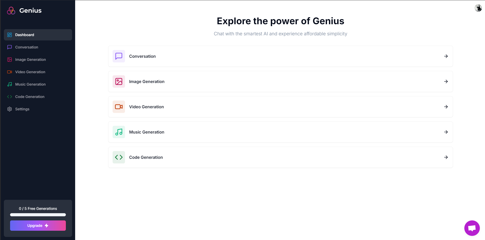

#  Genius

## A simplistic AI platform both in design and usability.



***Live demo:*** [https://genius-six-nu.vercel.app/](https://genius-six-nu.vercel.app/)

***NOTE:*** No API keys are set so the AI features do not function and is for display purposes only. For full functionality follow the below instructions. To test payments utilise Stripes test credit card details.

## Getting Started

1. Clone this repository:

```bash
git clone https://github.com/domdechiera/genius
```

2. Install dependencies:

```bash
npm install
```

3. Rename `.env-example` to `.env` and fill in your API keys, Supabase database URL, and Stripe webhooks endpoint URL obtained from:

   - Open AI API Keys: [https://platform.openai.com/api-keys](https://platform.openai.com/api-keys)
   - Replicate API Keys: [https://replicate.com/account/api-tokens](https://replicate.com/account/api-tokens)
   - Clerk API Keys: [https://dashboard.clerk.com/app/instances/api-keys](https://dashboard.clerk.com/apps/app_2nL1vIwafp2xEya6jELtIw4yu1I/instances/ins_2nL1vBVKaB8OFubJHuzGnVC2sgW/api-keys)
   - Stripe API Keys: [https://dashboard.stripe.com/test/apikeys](https://dashboard.stripe.com/test/apikeys)
   - Stripe Webhook Endpoint Creation and Secret Key: [https://dashboard.stripe.com/test/workbench/webhooks](https://dashboard.stripe.com/test/workbench/webhooks)
   - Supabase API Keys: [https://supabase.com/dashboard/project/[Your-Project-Name]/settings/api](https://supabase.com/dashboard/project/settings/api)
   - Supabase Database URL: [https://supabase.com/dashboard/project/[Your-Project-Name]/settings/database](https://supabase.com/dashboard/project/settings/database)

   

4. Run the development server:

```bash
npm run dev
```

4. For testing of Stripe payments run the following in a separate shell:

```bash
stripe listen --forward-to localhost:3000/api/webhook
```

Open [http://localhost:3000](http://localhost:3000) with your browser to see the result.

## The Stack

This is a [Next.js](https://nextjs.org/) project bootstrapped with [`create-next-app`](https://github.com/vercel/next.js/tree/canary/packages/create-next-app).

This project utilises the following third-party tools:

- [Clerk](https://clerk.com) - Authentication and user management.
- [Supabase](https://supabase.com) - The open source Firebase alternative.
- [Stripe](https://stripe.com) - Payment processing and subscription management.
- [shadcn/ui](https://ui.shadcn.com/) - Beautifully designed components that you can copy and paste into your apps.
- [Vercel](https://vercel.com) -  Build, scale, and secure a faster, more personalised web.
- [Lucide](https://lucide.dev/) - Beautiful and consistent icons.
- [Crisp](https://crisp.chat/) - Business messaging platform.
- [Tailwind CSS](https://tailwindcss.com/) - Rapidly build modern websites without ever leaving your HTML.
- [TypeScript](https://www.typescriptlang.org/) - JavaScript with syntax for types.
- [OpenAI API](https://platform.openai.com/) -  Utilise the latest AI models including DALL-E (Image Generation) and  GPT 4o-mini (Conversation and Code Generation).
- [Replicate AI](https://replicate.com) - Utilise a variety of AI models with a single API (Video and Music Generation).
- [Prisma ORM](https://prisma.io) - Simplify working and interacting with databases.

## Deploy on Vercel

The easiest way to deploy your Next.js app is to use the [Vercel Platform](https://vercel.com) from the creators of Next.js.

Check out the [Next.js deployment documentation](https://nextjs.org/docs/deployment) for more details.

---

Looking to learn how to code? Check out [Code with Antonio](https://www.codewithantonio.com/).

